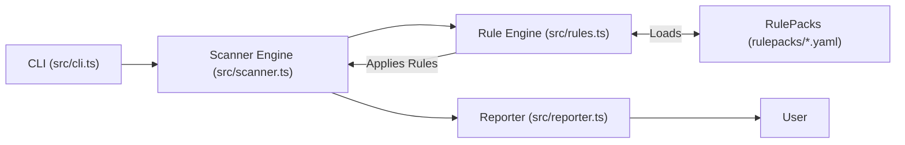

# PromptShield 🛡️

Secure your LLM stack with open-source RulePacks. Block jailbreaks, hallucinations, and compliance risks before they reach production.

## 🧐 What is it?
PromptShield is a dev-first security layer for AI outputs. It uses composable RulePacks to detect risky content in prompts and completions—PII, bias, hallucinations, and more.

### 🛠️ Core Features
- CLI & SDK (zero-config, dev-friendly)
- Modular RulePacks (e.g., HIPAA, Jailbreaks, GDPR)
- Score-based blocking and reporting
- No external calls – works offline

---

> **Built for devs. MIT-licensed. No lock-in. Use it anywhere LLMs run wild.**

---

## Table of Contents
- [Why PromptShield?](#why-promptshield)
- [RulePack Ecosystem](#rulepack-ecosystem)
- [Config-First Philosophy](#config-first-philosophy)
- [Features](#features)
- [Quickstart](#quickstart)
- [CLI Data Flow](#cli-data-flow)
- [Usage Example](#usage-example)
- [Example Output](#example-output)
- [Supported Rule Types](#supported-rule-types)
- [Directory Structure](#directory-structure)
- [Documentation](#documentation)
- [RulePack Registry](docs/RULEPACK_REGISTRY.md)
- [Community & Support](#community--support)
- [Security](#security)
- [Roadmap](#roadmap)
- [Contributing](#contributing)
- [License](#license)
- [License Summary Table](#license-summary-table)

---

## Why PromptShield?
- **Purpose-built for AI safety:** Scan prompts, responses, and datasets for risky content before it reaches production.
- **RulePack-first:** Easily extend with YAML-based rules for PII, bias, hallucinations, and more.
- **Enterprise-ready:** Modular, open-core, and designed for integration into CI/CD pipelines.
- **Fast onboarding:** Zero-friction setup, clear docs, and sample files included.
- **Community-driven:** Built for both open-source and commercial use cases.

---

## RulePack Ecosystem

PromptShield is built around a powerful, config-first RulePack system. **RulePacks are the npm modules of AI security**—modular YAML or JSON files that define policies, security checks, and compliance logic—no code changes required.

See the [RulePack Registry](docs/RULEPACK_REGISTRY.md) for a list of official and community RulePacks.

### Types of RulePacks
- **Compliance & Legal:** HIPAA, GDPR, EU AI Act, Executive Orders, and more. Detect PII, PHI, consent, export, and high-risk use cases.
- **Internal Policies:** Company secrets, employee info, red team traps, project codenames. Let security and compliance teams write and update rules without code changes.
- **Security & Risk:** Prompt injection, LLM hallucinations, API leaks, profanity, hate speech, and more. Plug-and-play for any LLM project.
- **Community Packs:** Anyone can contribute! Start a public RulePack (e.g., promptshield-rules-*) and submit a PR to get it featured.

### Why This Matters
- **Shift-left on compliance and security:** Catch issues before lawyers or auditors get involved by writing and sharing RulePacks.
- **Plug-and-play:** Update RulePacks, not code, to enforce new policies or respond to new risks.
- **Ecosystem growth:** The more RulePacks, the safer and more compliant the AI ecosystem becomes.

### Get Involved
- **Contribute a RulePack:** PRs for new RulePacks (compliance, security, niche) are welcome!
- **Get recognized:** Contributors to official or community RulePacks will be recognized in our docs and GitHub project.
- **Registry vision:** We plan to launch a public RulePack registry—submit your pack to help build the ecosystem!

---

## Config-First Philosophy

> **Policy as Data, Not Code**
>
> PromptShield is built on the belief that risk, compliance, and security enforcement should be modular, testable, and transparent—just like your codebase. With PromptShield, all enforcement logic lives in versioned RulePacks (YAML/JSON), not in application code. This means:
>
> - **Legal, security, and policy boundaries are enforced as data.**
> - **Devs can update rules, thresholds, and policies without code changes.**
> - **Compliance and security teams can contribute directly, shifting risk management left.**
> - **Enforcement is auditable, reviewable, and easy to test.**
>
> **Result:** Your AI safety and compliance layer is as flexible and composable as your code—no more hardcoded policies, no more black boxes. **Shift-left on compliance and security by writing and sharing RulePacks.**

---

## Features
- Modular, open-core CLI for prompt and response scanning
- RulePack system for custom, YAML-based rules
- Detects PII, bias, hallucinations, and more
- Extensible with plugins and custom rule types
- Designed for enterprise and open-source use
- Fast, developer-friendly workflow

---

## Quickstart

```sh
# Clone the repo
 git clone https://github.com/Sawyer0/promptshield.git
 cd promptshield

# Install dependencies
 npm install

# (Optional) Run tests
 npm test
```

---

## CLI Data Flow



---

## Usage Example: 3 Steps

1. **Install dependencies**
    ```sh
    npm install
    ```
2. **Scan a file with a RulePack**
    ```sh
    promptshield scan --input tests/fixtures/sample.txt --rules rulepacks/pii.yaml
    ```
3. **Review the results**
    - Violations and findings will be printed to your terminal.

---

## Example Output
```
[PII] Email address detected: john.doe@example.com (line 2)
[PII] Phone number detected: (555) 123-4567 (line 2)
[PII] Possible street address detected: 123 Main Street, Springfield, IL 62704 (line 3)
[PII] SSN detected: 123-45-6789 (line 4)
[PII] Credit card number detected: 4111 1111 1111 1111 (line 5)
```

---

## Supported Rule Types
| Type         | Description                                 | Status                |
|--------------|---------------------------------------------|-----------------------|
| Regex        | Pattern-based matching                      | Implemented           |
| Keyword      | Simple text matching                        | Implemented           |
| Custom       | User-defined logic via plugins/extensions    | Supported (extensible)|
| NLP          | AI-powered content analysis (LLM, etc.)     | Planned               |

---

## Directory Structure

```
promptshield/
├── src/                # Core application code
│   ├── cli.ts
│   ├── scanner.ts
│   ├── rules.ts
│   ├── reporter.ts
│   └── utils.ts
├── rulepacks/          # Example and custom RulePacks
│   ├── pii.yaml
│   ├── bias.yaml
│   └── hallucination.yaml
├── tests/              # Test suite and fixtures
│   ├── fixtures/
│   │   └── sample.txt
│   ├── cli.test.ts
│   ├── scanner.test.ts
│   ├── rules.test.ts
│   ├── reporter.test.ts
│   └── smoke.test.ts
├── docs/               # Documentation
│   ├── ARCHITECTURE.md
│   ├── RULE_ENGINE.md
│   ├── EXTENSIONS.md
│   ├── RULEPACK_GUIDE.md
│   └── promptshield_mvp_spec.md
├── package.json
└── README.md
```

---

## Documentation
- [Architecture Overview](docs/ARCHITECTURE.md)
- [Rule Engine Internals](docs/RULE_ENGINE.md)
- [Extensions & Plugin System](docs/EXTENSIONS.md)
- [RulePack Authoring Guide](docs/RULEPACK_GUIDE.md)
- [PromptShield MVP Checklist](docs/promptshield_mvp_spec.md)

---

## Community & Support
- [GitHub Issues](https://github.com/Sawyer0/promptshield/issues) — Bug reports & feature requests
- [Discussions](https://github.com/Sawyer0/promptshield/discussions) — Community Q&A (if enabled)
- For commercial support or partnership, contact the project owner via GitHub

> **Help us build the npm for AI security!**

---

## Security
- Please report security vulnerabilities via [GitHub Issues](https://github.com/Sawyer0/promptshield/issues) or contact the maintainer directly.
- PromptShield is designed with security in mind: all file and user input is validated and sanitized.

---

## Roadmap
- [ ] Add NLP-based rule types
- [ ] Add more built-in RulePacks (toxicity, jailbreak, etc.)
- [ ] Add web/GUI frontend
- [ ] Add CI/CD integration helpers
- [ ] Improve reporting and output formats
- [ ] Expand plugin system and API

---

## Contributing
We welcome contributions! Please see [docs/CONTRIBUTING.md](docs/CONTRIBUTING.md) for guidelines on adding new rules, output formats, or features.

---

## License
- **CLI and core logic:** MIT License (see LICENSE)
- **RulePacks, advanced middleware, commercial add-ons:** Proprietary, commercial use requires a separate license

---

## License Summary Table
| Component                                 | License      | Notes                                  |
|-------------------------------------------|-------------|----------------------------------------|
| CLI & core logic                          | MIT         | Open source, permissive                |
| RulePacks (e.g., pii.yaml, bias.yaml)     | Proprietary | Commercial use requires a license      |
| Advanced middleware, commercial add-ons   | Proprietary | Contact project owner for licensing    |

---

## 📝 Developer Docs

- [RulePack Authoring Guide](docs/RULEPACK_GUIDE.md)
- [Architecture Overview](docs/ARCHITECTURE.md)
- [Rule Engine Spec](docs/RULE_ENGINE.md)

---

## 🧰 What You Can Do

```bash
promptshield scan prompts.txt         # Scan file for violations
promptshield test "input text here"   # Scan a single string
promptshield init                     # Bootstrap a RulePack project
promptshield update                   # Fetch latest official RulePacks
```
