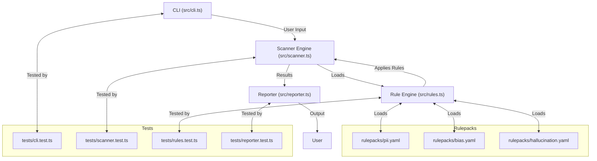

# PromptShield Architecture

## Policy-Driven Enforcement Diagram

PromptShield enforces risk, compliance, and security policies as data, not code. Here’s how the enforcement flow works:

```mermaid
graph LR
    A[RulePack Config (YAML/JSON)] --> B[Rule Engine]
    B --> C{Evaluate Content}
    C -->|"No Violation"| D[Allow]
    C -->|"Violation"| E[Flag/Block/Report]
    E --> F[Output: CLI, Logs, Audit, API]
```

- **RulePack Config:** All policies and rules are defined as data.
- **Rule Engine:** Loads, validates, and applies rules to content.
- **Enforcement:** Flags, blocks, or reports violations based on config.
- **Output:** Results are sent to CLI, logs, audit trails, or APIs for further action.

---

## Visual Architecture Diagram



## File Path Examples

- Rulepacks: [`rulepacks/pii.yaml`](rulepacks/pii.yaml), `rulepacks/bias.yaml`, `rulepacks/hallucination.yaml`
- Fixtures: [`tests/fixtures/sample.txt`](tests/fixtures/sample.txt)
- Docs: `docs/PRINCIPLES.md`, `docs/vibecode/promptshield_mvp_spec.md`
- CLI: `src/cli.ts`
- Core: `src/scanner.ts`, `src/rules.ts`, `src/reporter.ts`

## MVP Checklist

See the [PromptShield MVP Checklist](./vibecode/promptshield_mvp_spec.md) for required features and progress tracking.

## (Optional) Split-out Documents

- See `RULE_ENGINE.md` for rule engine internals (planned)
- See `EXTENSIONS.md` for extension/plugin system (planned)

## Contributor Instructions

See `docs/CONTRIBUTING.md` for how to add new rule types or output formats.

## How to Contribute RulePacks

Want to help make AI safer and more compliant? Contributing a RulePack is the best way to have an impact!

- See the [RulePack Authoring Guide](RULEPACK_GUIDE.md) for how to write and test your own RulePack.
- Check the [RulePack Registry](RULEPACK_REGISTRY.md) for examples and inspiration.
- Fork the repo, add your RulePack to the `rulepacks/` directory, and submit a pull request (PR).
- All contributors to official or community RulePacks will be recognized in our docs and GitHub project!

---

This architecture provides a solid foundation for PromptShield's growth from a CLI tool to a comprehensive AI safety platform while maintaining simplicity and developer experience.
