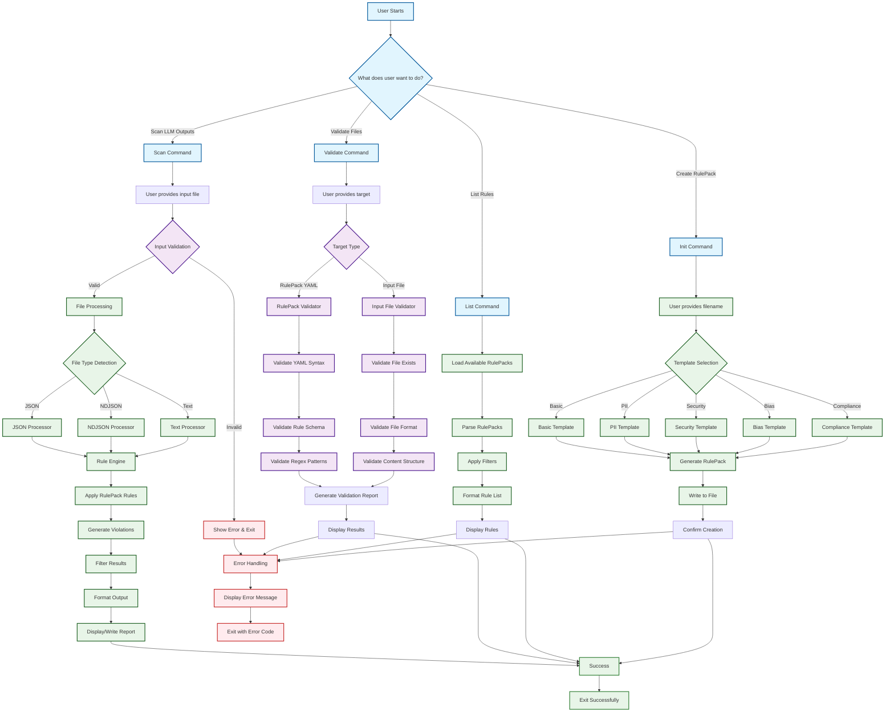

# PromptShield User Flow Diagram

## Overview

This diagram shows the complete user journey through PromptShield, from initial setup to scanning and validation.



## Detailed User Journeys

### 1. **Scan Command Journey**

```
User Input → Validation → Processing → Rule Application → Output Generation
```

**Key Steps:**

1. **Input Validation** - Validates file exists and format
2. **File Processing** - Detects JSON/NDJSON/Text and processes accordingly
3. **Rule Application** - Applies RulePack rules to content
4. **Violation Generation** - Creates violation objects for matches
5. **Filtering** - Applies severity/category filters
6. **Output Formatting** - Generates report in requested format

### 2. **Validate Command Journey**

```
User Target → Type Detection → Specific Validation → Report Generation
```

**Key Steps:**

1. **Target Analysis** - Determines if RulePack or input file
2. **RulePack Validation** - YAML syntax, rule schema, regex patterns
3. **Input File Validation** - File existence, format, content structure
4. **Report Generation** - Detailed validation results

### 3. **List Command Journey**

```
RulePack Discovery → Parsing → Filtering → Display
```

**Key Steps:**

1. **Discovery** - Finds available RulePacks
2. **Parsing** - Reads and parses YAML files
3. **Filtering** - Applies category/severity filters
4. **Display** - Shows formatted rule list

### 4. **Init Command Journey**

```
Template Selection → Generation → File Creation → Confirmation
```

**Key Steps:**

1. **Template Selection** - User chooses template type
2. **Generation** - Creates RulePack with sample rules
3. **File Creation** - Writes YAML file to disk
4. **Confirmation** - Shows success message

## Validation Points (All Tested ✅)

### **Input File Validation**

- ✅ File existence check
- ✅ File format validation (JSON, NDJSON, Text)
- ✅ Content structure validation
- ✅ File readability check

### **RulePack Validation**

- ✅ YAML syntax validation
- ✅ Rule schema validation
- ✅ Regex pattern validation
- ✅ Required fields validation

### **Validation Engine**

- ✅ Type detection based on file extension
- ✅ Validator selection and routing
- ✅ Error propagation and handling
- ✅ Batch validation support

### **Violation Handling**

- ✅ Violation object creation
- ✅ Position and context tracking
- ✅ Metadata and confidence scoring
- ✅ Severity and category classification

## Error Handling

### **User-Friendly Errors**

- File not found → Clear error message with path
- Invalid format → Explanation of supported formats
- Validation failures → Detailed error report
- Processing errors → Graceful degradation

### **Exit Codes**

- `0` - Success
- `1` - Validation errors
- `2` - Processing errors
- `3` - Configuration errors

## Performance Considerations

### **Streaming Support**

- Large JSON arrays → Streaming processing
- NDJSON files → Line-by-line processing
- Memory management → Threshold warnings

### **Parallel Processing**

- Multi-core scanning → Parallel rule application
- Batch processing → Configurable batch sizes
- Timeout handling → Processing time limits

This flow diagram represents the complete user experience, with all the validation and processing steps that users will encounter when using PromptShield.
